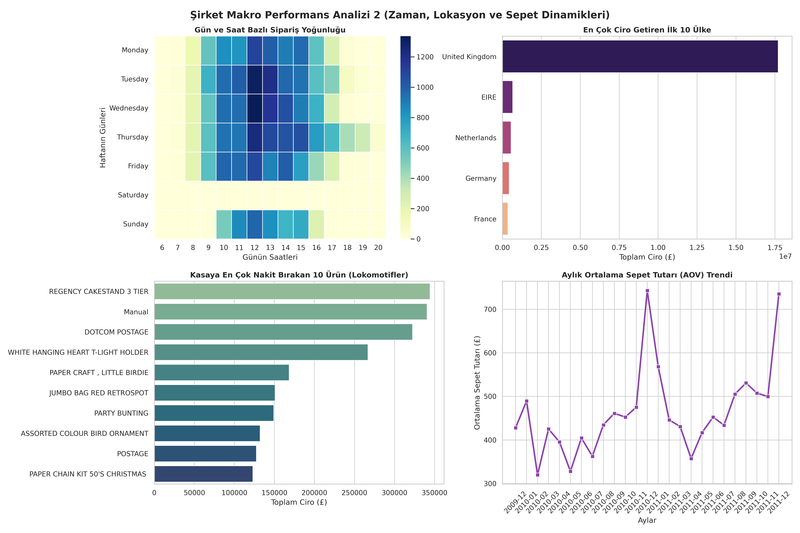
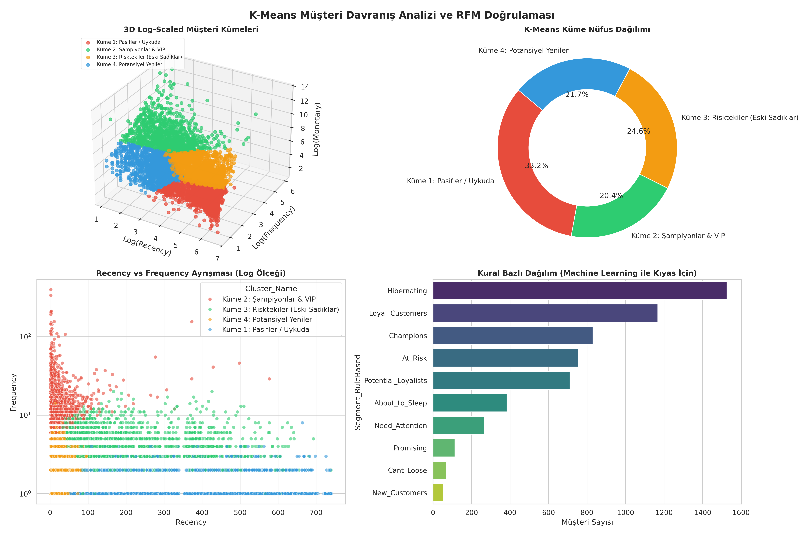

# E-Ticaret Omni-Channel Satış Analizi ve Müşteri Kümeleme Projesi
## Proje Hakkında
Bu proje, bir e-ticaret şirketinin 2009-2011 yılları arasındaki satış verilerini kapsamlı şekilde analiz eden bir veri bilimi projesidir. Proje kapsamında makro satış analizleri (ciro, iade oranları, ülke bazlı performans) yapılmakta, RFM (Recency, Frequency, Monetary) analizi ile kural tabanlı müşteri segmentasyonu gerçekleştirilmekte ve K-Means kümeleme algoritması ile unsupervised müşteri segmentasyonu uygulanıp karşılaştırılması da yapılmaktadır. Ayrıca 3D grafikler, ısı haritaları ve interaktif dashboard'lar gibi gelişmiş görselleştirmeler ile sonuçlar sunulmaktadır.

##  Veri Seti (Dataset) Bilgisi
Projede kullanılan "Online Retail II" veri seti GitHub dosya boyutu sınırlarını aştığı için repoya doğrudan yüklenmemiştir. Kodu kendi bilgisayarınızda çalıştırmak için orijinal veri setini aşağıdaki bağlantıdan indirip kod ile aynı dizine koyabilirsiniz:
* 🔗 [Kaggle - Online Retail II Data Set](https://www.kaggle.com/datasets/mathchi/online-retail-ii-data-set-from-uci-ml-repo)

## Özellikler
Veri İşleme ve Optimizasyon
Büyük veri setlerinde bellek optimizasyonu (veri tipi dönüşümleri) yapılmakta, iki farklı yıl verisi birleştirilmekte ve tarihsel veri işleme ile özellik mühendisliği uygulanmaktadır.

## Makro Satış Analizleri
Aylık ciro trendleri, kayıtlı vs misafir kullanıcı ciroları, iade analizleri (zarar oranları, en çok iade edilen ürünler), ülke bazlı performans analizi ve gün-saat bazlı sipariş yoğunluğu (heatmap) gibi kapsamlı analizler yapılmaktadır.

## RFM Analizi
Kural bazlı müşteri segmentasyonu (Champions, Loyal, At Risk, vs.), Recency, Frequency, Monetary skorlaması ve segment bazlı müşteri dağılımı analiz edilmektedir.

## K-Means Kümeleme
Logaritmik dönüşüm ile veri normalizasyonu, Elbow method ile optimum küme sayısı belirleme (k=4), 3D görselleştirme ile küme ayrışmaları ve hiperparametre optimizasyonu yapılmaktadır.

## Görselleştirme
3D scatter plot ile müşteri kümeleri, ısı haritası ile zaman analizi, donut grafikler ile dağılım analizleri ve çapraz tablo ile RFM-KMeans karşılaştırması sunulmaktadır.

## Çıktılar
Proje çalıştırıldığında üç adet dashboard oluşturulmaktadır. Birincisi macro_sales_dashboard1.png adıyla şirket makro performans analizini, ikincisi macro_sales_dashboard2.png adıyla zaman, lokasyon ve sepet dinamiklerini, üçüncüsü ise kmeans_rfm_dashboard.png adıyla K-Means ve RFM karşılaştırma dashboard'unu içermektedir.

## Teknolojiler
Projede Python 3.8+ sürümü kullanılmakta olup, Pandas ile veri işleme, NumPy ile sayısal hesaplamalar, Matplotlib ile görselleştirme, Seaborn ile istatistiksel görselleştirme ve Scikit-learn ile makine öğrenmesi (StandardScaler, KMeans) işlemleri gerçekleştirilmektedir.

## Veri Seti
Veri seti 2009-2011 yılları arasındaki bir e-ticaret satış kayıtlarını içermektedir. Year 2009-2010.csv ve Year 2010-2011.csv olmak üzere iki dosyadan oluşmaktadır. Veri sütunları arasında Invoice (fatura numarası), StockCode (ürün kodu), Description (ürün açıklaması), Quantity (miktar), InvoiceDate (fatura tarihi), Price (birim fiyat), Customer ID (müşteri ID) ve Country (ülke) bulunmaktadır.

## Kurulum
Repository'yi klonladıktan sonra, sanal ortam oluşturup (önerilen) gerekli kütüphaneleri yüklemeniz gerekmektedir. Pandas, NumPy, Matplotlib, Seaborn ve Scikit-learn kütüphanelerini pip ile yükledikten sonra, veri dosyalarını proje dizinine kopyalayıp Churn.py script'ini çalıştırabilirsiniz.

## Kullanım
Script çalıştırıldığında sırasıyla veriler yüklenir ve optimize edilir, makro satış analizleri yapılır, ilk iki dashboard oluşturulur, RFM analizi uygulanır, K-Means kümeleme yapılır, son dashboard oluşturulur ve sonuçlar ekrana yazdırılır. Örnek çıktılar arasında toplam işlem hacmi, brüt ciro, iade tutarları ve kayıtlı/misafir müşteri ciroları gibi metrikler yer almaktadır.

## Proje Akışı
Proje altı ana fazdan oluşmaktadır(Verinin özellikleri shape, info, columns, isnull gibi fonksiyonlarla taranmış ve karar alınmıştır fakat bu python dosyasında bulunmamaktadır.). Birinci fazda CSV dosyaları okunmakta, veri tipleri optimize edilmekte ve toplam fiyat sütunu oluşturulmaktadır. İkinci fazda iade ve normal işlem ayrımı yapılmakta, kayıtlı/misafir müşteri analizi gerçekleştirilmekte ve dashboard oluşturulmaktadır. Üçüncü fazda makine öğrenmesi için veri filtrelenmekte ve temizlenmektedir. Dördüncü fazda RFM metrikleri hesaplanmakta ve kural bazlı segmentasyon uygulanmaktadır. Beşinci fazda logaritmik dönüşüm, standardizasyon ve 4 küme oluşturma işlemleri yapılmaktadır. Altıncı ve son fazda ise RFM ve K-Means karşılaştırması yapılmakta ve görselleştirmeler oluşturulmaktadır.

## 📈 İş Zekası (BI) Dashboard Çıktılarımız

Aşağıdaki panolar, Python kodumuz tarafından otomatik olarak üretilen ve şirketin makro/mikro dinamiklerini yansıtan çıktılardır.

### 1. Şirket Makro Performans Analizi (Satış, İade ve Müşteri Kanalları)

### 2. Zaman, Lokasyon ve Sepet Dinamikleri

### 3. Makine Öğrenmesi: K-Means Müşteri Kümeleri ve RFM Doğrulaması

## Sonuçlar
Proje sonucunda şirket, en değerli müşteri segmentlerini (hangilerine yatırım yapmalı?), zaman bazlı stratejileri (hangi gün ve saatlerde kampanya yapmalı?), ürün bazlı optimizasyonu (hangi ürünler lokomotif, hangileri sorunlu?), müşteri davranış modellerini (kullanıcılar nasıl alışveriş yapıyor?) ve churn riskini (hangi müşteriler kaybedilmek üzere?) öğrenebilmektedir.
